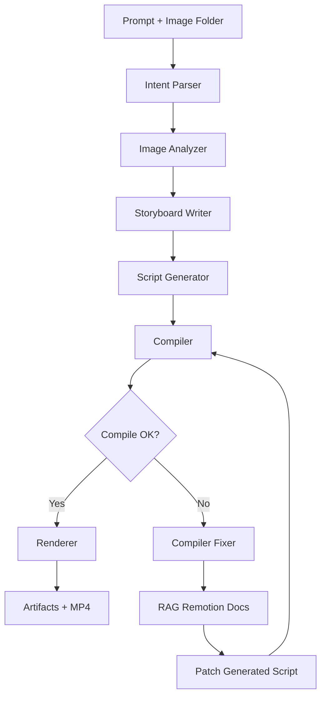
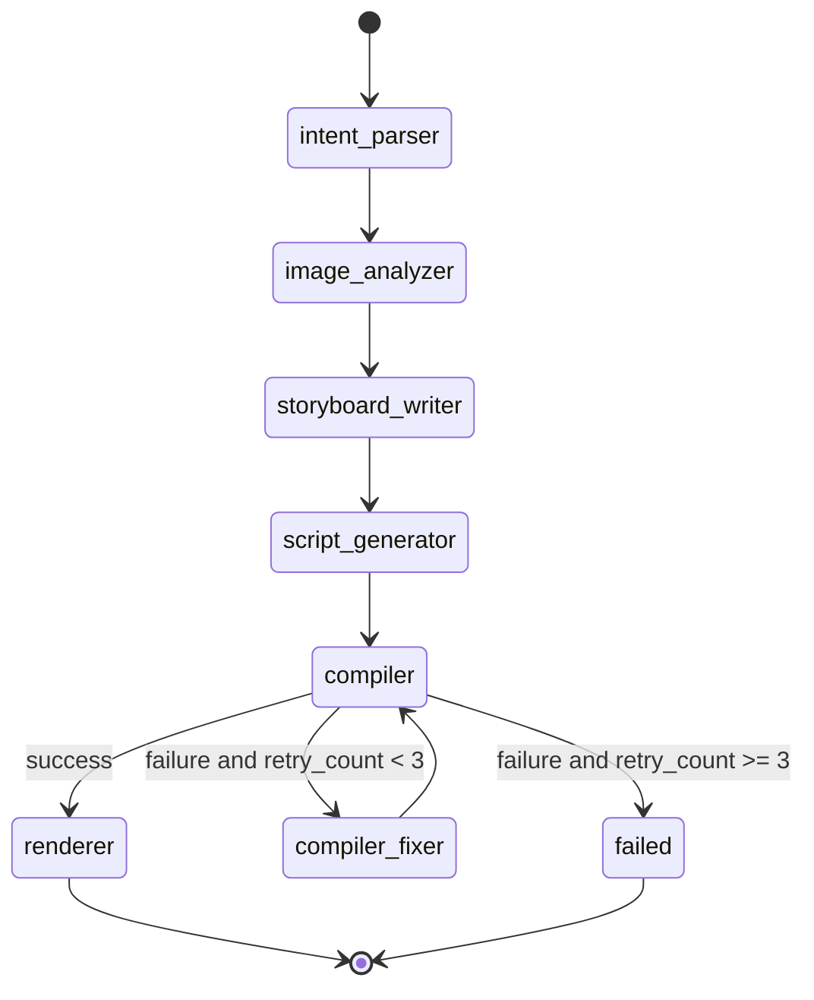

# FotoOwl AI Engineer Take Home Assignment

Production-quality image-to-video pipeline built with Python, LangGraph, LangChain, ChromaDB, Gemini, FastAPI, Remotion, React, and TypeScript.

## What It Does

Input:
- A folder of event images
- A prompt describing the desired video style

Output:
- `outputs/video_intent.json`
- `outputs/analysis.json`
- `outputs/storyboard.json`
- `outputs/generated_script.tsx`
- `outputs/compile_log.txt`
- `outputs/render_log.txt`
- `outputs/final_video.mp4`
- `outputs/pipeline_state.json`

The pipeline:
1. Parses the creative prompt into structured intent JSON.
2. Analyzes every image with Gemini vision plus local image quality metrics.
3. Selects the best images for the story.
4. Writes a structured storyboard.
5. Generates valid Remotion TypeScript.
6. Compiles the script.
7. Repairs targeted compiler failures using RAG-backed Remotion docs.
8. Retries compilation up to 3 times.
9. Renders the final MP4.

## Stack

- Backend: Python 3.11+
- Agent graph: LangGraph
- RAG: LangChain + ChromaDB
- Embeddings: `BAAI/bge-small-en-v1.5`
- Text LLM: `gemini-2.0-flash-lite`
- Vision LLM: `gemini-2.0-flash`
- API: FastAPI
- Browser runner: static HTML + JavaScript
- Frontend/rendering: Remotion + React + TypeScript
- Runtime: local-first with Gemini API calls

## Architecture

### High-Level Flow



### State Diagram



### Clean Architecture Notes

- `backend/schemas/`: shared Pydantic contracts for intent, storyboard, compile errors, and pipeline state
- `backend/agents/`: business logic for each pipeline stage
- `backend/rag/`: vector store, embeddings, seeding, and retrieval abstractions
- `backend/graph/`: LangGraph nodes, edges, and workflow assembly
- `backend/compiler/` and `backend/renderer/`: infrastructure services for TypeScript compilation and Remotion rendering
- `backend/utils/`: logging, model clients, file I/O, image metrics, and evaluation helpers
- `frontend/remotion/`: Remotion app that consumes generated TSX
- `frontend/web/`: lightweight browser UI for local use and Vercel deployment

The code follows dependency injection by assembling concrete services in `backend/dependencies.py`. Tests replace model, retriever, compiler, and renderer dependencies with fakes. The browser-facing API lives in `backend/api.py`.

## Folder Structure

```text
backend/
  agents/
  compiler/
  docs/
    remotion/
    styles/
  graph/
  rag/
  renderer/
  schemas/
  tests/
  utils/
  config.py
  dependencies.py
  main.py
frontend/
  remotion/
outputs/
provided_images_subset/
sample_output/
sample_images/
.env.example
requirements.txt
README.md
```

## RAG Design

### Collections

- `styles`: creative guidance for montage structure and captioning
- `remotion_docs`: Remotion API and implementation guidance used during generation and repair

### Chunking Strategy

- Style guides are chunked by short semantic paragraph groups.
- Remotion docs are chunked by API concept or usage pattern.
- The seeder uses paragraph-aware chunking instead of fixed-line splitting so retrieval keeps concept boundaries intact.

### Retrieval Strategy

- Storyboard writer retrieves from `styles` using `video_style`, `pacing`, and `animation_style`.
- Script generator retrieves from `remotion_docs` using animation, transition, and caption intent.
- Compiler fixer retrieves from `remotion_docs` using actual compiler errors and issue messages.

## Model Routing

- `gemini-2.0-flash-lite`
  - Intent parsing
  - Storyboard writing
  - Script creative directives
  - Compiler fix generation
  - LLM-as-judge evaluation in tests via mocks
  - Rationale: low-cost, low-latency structured JSON generation for repeated text-heavy agent calls.

- `gemini-2.0-flash`
  - Per-image scene understanding
  - People / objects / emotion / quality / relevance extraction
  - Rationale: stronger multimodal reasoning for image analysis, while text-heavy calls stay on Flash-Lite for cost control.

- `offline`
  - Deterministic local fallback for quota-blocked demos and CI-style smoke runs.
  - Rationale: keeps the LangGraph/API/Remotion path runnable without API spend; production/default deploy config remains Gemini.

- Local deterministic logic
  - Blur score
  - Brightness score
  - Image ranking
  - Asset copying
  - Remotion TSX code construction

## Engineering Decisions

- Deterministic TSX generation:
  - The generator uses the LLM for creative directives but builds the final TypeScript script deterministically for higher compile reliability.

- Compiler retry loop:
  - Failed compilation does not restart the full pipeline.
  - Only the generated TSX is patched.
  - Retries stop after 3 attempts and return structured failure state.

- Shared state:
  - A single Pydantic `PipelineState` carries all intermediate and final artifacts.

- Local assets for rendering:
  - Selected images are copied into `frontend/remotion/public/generated_assets/` and referenced through `staticFile()` so Remotion renders reliably.

- Replaceable services:
  - Gemini clients, retriever, compiler, and renderer are injected and mockable.

## Installation

### 1. Create Python Environment

```bash
python3 -m venv .venv
. .venv/bin/activate
pip install -r requirements.txt
```

### 2. Install Frontend Dependencies

```bash
cd frontend/remotion
npm install
cd ../..
```

### 3. Create Environment File

```bash
cp .env.example .env
```

Set `GEMINI_API_KEY` in `.env`.

The default `.env.example` uses `MODEL_PROVIDER=gemini`, `TEXT_MODEL=gemini-2.0-flash-lite`, and `VISION_MODEL=gemini-2.0-flash`.
For local quota-free demos, set `MODEL_PROVIDER=offline`.

## Run Instructions

### API Server

This exposes local HTTP endpoints for sample runs and uploaded images.

```bash
.venv/bin/uvicorn backend.api:app --host 127.0.0.1 --port 8000
```

### Browser UI

Serve the lightweight browser client locally:

```bash
cd frontend/web
python3 -m http.server 4173 --bind 127.0.0.1
```

Then open `http://127.0.0.1:4173` and point it at `http://127.0.0.1:8000`.

### End-to-End Backend Command

This runs the full LangGraph pipeline from the CLI, including analysis, script generation, compilation, retries, and rendering.

```bash
.venv/bin/python -m backend.main \
  --input-dir provided_images_subset \
  --prompt "Create a cinematic event recap with elegant captions, warm color grading, and smooth fades."
```

`provided_images_subset/` contains 12 images downloaded from the assignment Google Drive folder. `sample_images/` remains as a tiny local fallback.

### Standalone Remotion Render Command

If you want to re-render the latest generated script without re-running the backend:

```bash
cd frontend/remotion
npm run render
```

## Outputs

- `outputs/video_intent.json`: structured prompt intent
- `outputs/analysis.json`: per-image Gemini vision analysis plus quality metrics
- `outputs/storyboard.json`: scene-by-scene narrative plan
- `outputs/generated_script.tsx`: generated Remotion component
- `outputs/compile_log.txt`: TypeScript compile output
- `outputs/render_log.txt`: Remotion render logs
- `outputs/final_video.mp4`: rendered video
- `outputs/pipeline_state.json`: full pipeline state snapshot

## Testing

Run the Python test suite:

```bash
.venv/bin/pytest backend/tests
```

Included tests:
- intent parser
- image analyzer
- storyboard writer
- RAG retrieval
- script generator
- compiler retry flow
- renderer
- LLM-as-judge narrative coherence

Tests do not require Ollama or local models because model calls are mocked.

## Sample Output

`sample_output/` contains reviewable artifacts from a successful run:

- `video_intent.json`
- `analysis.json`
- `storyboard.json`
- `generated_script.tsx`
- `compile_log.txt`
- `pipeline_state.json`
- `final_video.mp4`

## Verified Locally In This Build

- Python package installation
- FastAPI server boot on `http://127.0.0.1:8000`
- Browser UI served on `http://127.0.0.1:4173`
- Frontend package installation
- `pytest` suite: 9 passing tests
- Remotion TypeScript compilation
- Remotion render to `outputs/final_video.mp4`
- Rendered MP4 visual check confirms all generated scenes and captions are visible
- Full pipeline run completed on the official Drive image subset in `provided_images_subset/`
- `sample_output/` refreshed from that completed official-image run
- Gemini-backed API calls were smoke-tested; current key quota is exhausted, so local final artifacts were produced with `MODEL_PROVIDER=offline`

## Deployment

### Render

- `render.yaml` deploys the FastAPI backend with Docker.
- Set `GEMINI_API_KEY` in the Render dashboard before starting the service.
- Optional Render env overrides: `TEXT_MODEL=gemini-2.0-flash-lite`, `VISION_MODEL=gemini-2.0-flash`.
- The backend exposes `/health`, `/run-sample`, `/run-upload`, and `/artifacts/...`.

### Vercel

- `vercel.json` serves the static browser UI from `frontend/web`.
- Deploy the repo to Vercel and set the backend URL in the page to your Render service URL.

## Known Limitations

- Free-tier Gemini quotas can interrupt end-to-end runs; the API now returns the exact quota error instead of failing silently.
- Remotion dependency audit currently reports upstream vulnerabilities from installed packages.
- The default seeded Remotion docs are intentionally concise and can be expanded for broader API coverage.
- Compiler repair currently rewrites the generated TSX as a full corrected file rather than applying a minimal diff patch.

## Future Improvements

- Expand Remotion doc corpus with additional motion patterns and layout primitives.
- Add richer image metrics such as face sharpness and aesthetic scoring.
- Add optional background music track selection and waveform-aware caption timing.
- Persist historical runs for experiment comparison and prompt iteration.
- Add integration tests that run against a locally available Ollama server.
